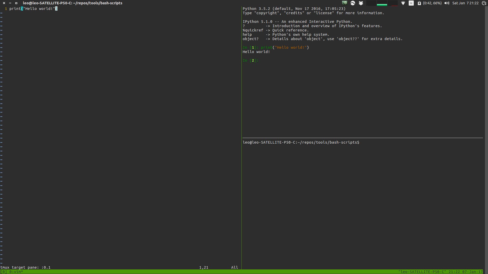

# IDETMUX
Create an RStudio-style setup with your REPL of choice and vim as your text editor.

Need [vim-slime](https://github.com/jpalardy/vim-slime) plugin 

The script does the following:
 * Opens a tmux session
 * Opens vim to the filename if supplied, opens empty vim otherwise
 * Splits the window vertically
 * Opens the chosen REPL in the right-hand pane
 * Splits the right-hand pane horizontally
 * Changes focus back to the left-hand pane containing vim.

The end result is a tmux session with vim in the left hand of the screen, the REPL in the top-right corner and an empty terminal in the bottom right.

Send code to the REPL by holding down CTRL and double-tapping c.

The first time you do this, you will be prompted for a socket name (this can be left as 'default') and  target pane. Let the target pane be "0.1", meaning top-right panel.

## Usage
Open a specific Python file (in the current directory) and IPython console
```
idetmux ipython foo.py
```
Open an unnamed file and Scala console
```
idetmux scala
```
Open an R console and R file
```
idetmux R /path/to/your/file.r
```

## Navigation
Press "CTRL+b, left/right/up/down arrow" to move from one tmux pane to another.


